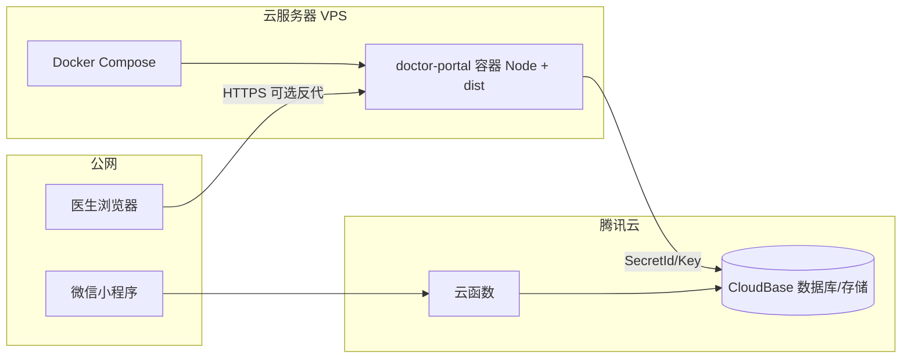

# 痛风慢病管理 — 后端集成设计书

## 1. 文档目的与范围

本文档说明仓库内**可部署到自有云服务器（如腾讯云轻量应用服务器）**的后端集成方案：将「医生 Web 管理端」的后端服务统一纳入 `all/` 目录，通过 **Docker Compose** 一键构建与运行。

**纳入范围**

- `goutcare---doctor-portal (1)/`：Express 5 + Vite/React 医生端，提供 `/api/*` 接口并在生产环境托管静态前端 `dist/`。

**明确不纳入本机 Docker 镜像的部分（仍使用腾讯云托管能力）**

- 微信小程序侧 **云函数**（如 `cloudfunctions/healthDataService` 等）：运行于微信云开发/云函数环境，与 VPS 无直接进程关系。
- **CloudBase 云数据库 / 云存储**：数据仍存放在腾讯云开发环境；VPS 上的 Node 进程通过 `@cloudbase/node-sdk` 以**服务端密钥**访问，**无需**在服务器上自建 MySQL/PostgreSQL。

---

## 2. 现状与集成结论

| 组件 | 技术 | 说明 |
|------|------|------|
| HTTP API | Express 5 | 路由前缀 `/api/auth`、`/api/patients`、`/api/education` |
| 数据层 | 腾讯云 CloudBase 数据库 | `server/db.ts` 初始化 SDK，集合如 `users`、`education_articles` |
| 会话 | JWT + HttpOnly Cookie | `JWT_SECRET`、`COOKIE_SECURE` 与 HTTPS 场景相关 |
| 前端 | Vite 构建 SPA | 生产模式由 `server.ts` 挂载 `dist/` 并做 SPA fallback |
| 可选 AI | `@google/genai`（前端） | 构建期注入 `GEMINI_API_KEY`（见 `vite.config.ts`） |

集成策略：**单容器单进程** — 同一 Node 进程既提供 API 又提供静态资源，与当前 `server.ts` 设计一致，避免拆分为「纯 API + 独立 Nginx 静态站」带来的额外运维成本（若后续流量增大可再拆分）。

---

## 3. 逻辑架构

- **医生 Web**：浏览器访问 VPS 上的容器端口（或经 Nginx/Caddy 反代 80/443）。
- **小程序**：仍走云函数 + CloudBase，与 VPS **并行**访问同一 CloudBase 环境（需环境 ID、集合与安全规则一致）。

---

## 4. 目录与交付物（`all/`）

| 文件 | 作用 |
|------|------|
| `docker-compose.yml` | 定义服务、端口映射、环境变量与构建参数 |
| `Dockerfile` | 多阶段构建：安装依赖 → `npm run build` → 生产镜像运行 `tsx server.ts` |
| `.env.example` | 环境变量模板，复制为 `.env` 后部署 |
| `INTEGRATION_DESIGN.md` | 本文档 |
| `CONFIG_DEPLOY.md` | 云服务器上的配置与部署步骤 |
| `nginx.conf.example` | 可选：Nginx 反向代理与 HTTPS 参考 |

源码仍位于 `goutcare---doctor-portal (1)/`，**不在 `all/` 内重复拷贝**，通过 Compose 的 `build.context` 指向该目录，避免双份维护。

---

## 5. 镜像构建与运行时配置要点

1. **构建期**：前端依赖 `GEMINI_API_KEY` 时，需通过 `docker compose build` 的 build args 或宿主 `.env` 中变量传入（与本地 Vite 一致，已支持 `process.env.GEMINI_API_KEY`）。
2. **运行期**：CloudBase 与 JWT 等敏感变量仅通过容器环境注入，**不要**写入镜像层。
3. **端口**：应用监听 `PORT`（默认 3000），`docker-compose.yml` 将容器 3000 映射到宿主机 `HOST_PORT`（默认 3000）。
4. **Cookie**：HTTPS 终端部署时 `COOKIE_SECURE=true`；若仅 HTTP 且未做 TLS，`sameSite`/`secure` 行为需与 `auth.ts` 中逻辑一致，必要时将 `COOKIE_SECURE=false`（见代码与 `.env.example` 注释）。

---

## 6. 安全与合规

- CloudBase **SecretId/SecretKey** 具备数据库级权限，等同于生产密钥，需限制 `.env` 文件权限与服务器 SSH 访问。
- 建议在控制台为数据库集合配置**最小权限**（患者端只读、写操作仅服务端），与现有 `DATABASE_EDUCATION_SETUP.md` 思路一致。
- 公网暴露端口时，应在云厂商安全组/防火墙中仅开放 **80/443**（或经反代后关闭直连 3000）。

---

## 7. 扩展与演进（非本次必须）

- 增加独立 `nginx`/`caddy` 服务容器做 TLS 终止与限流。
- 将 `tsx` 替换为 `tsc` 编译产出 JS，缩小生产镜像。
- 多实例 + 负载均衡时，需确认 Session/Cookie 与日志采集策略。

---

## 8. 版本与假设

- 设计针对 **Ubuntu 22.04 + Docker 20+（截图环境为 Docker 26）**。
- Node 镜像基于 **Node 22 Alpine**，与项目 `package.json` 引擎假设兼容；若遇原生模块问题可改用 `node:22` 非 Alpine 镜像。
